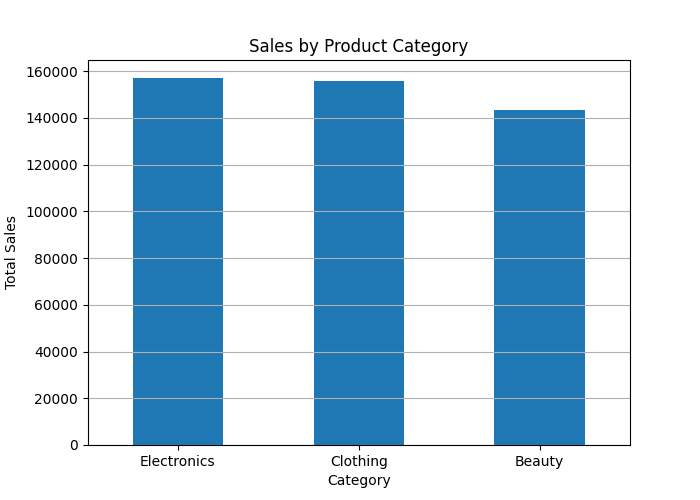
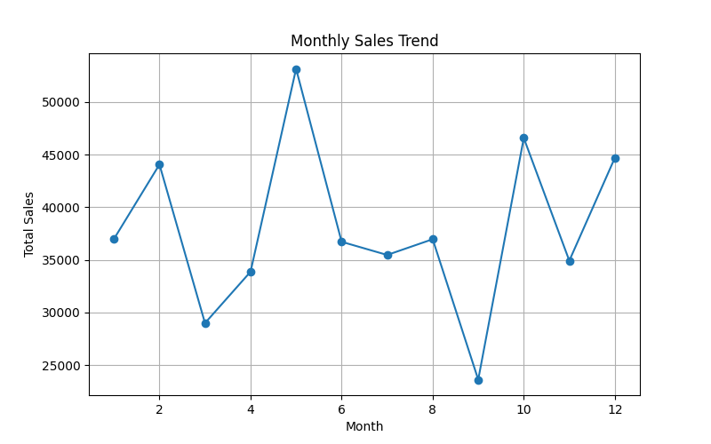
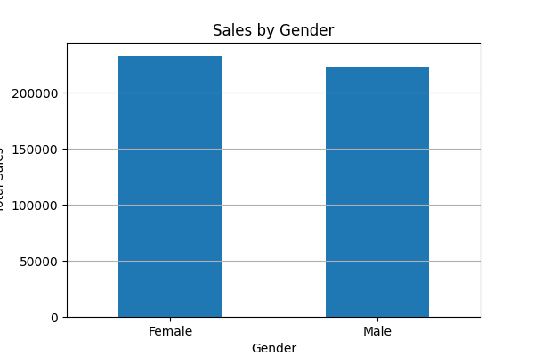

# Retail Sales EDA Project
 
## Project Overview

This project performs Exploratory Data Analysis (EDA) on a retail sales dataset using Python, Pandas, and Matplotlib.

The objective of this project is to analyze customer purchasing behavior, identify sales trends, and generate business insights from transactional retail data.

---

## Tools & Libraries Used

- Python
- Pandas
- Matplotlib
- VS Code

---

## Dataset Information

The dataset contains:

- Transaction details
- Customer demographics
- Product categories
- Sales amounts
- Purchase dates

Total Records: 1000  
Total Columns: 9

---

## Project Workflow

### 1. Data Loading
- Loaded CSV dataset using Pandas
- Converted date column into datetime format

### 2. Data Inspection
Performed:
- Dataset structure analysis
- Missing value checks
- Statistical summary
- Unique category inspection

### 3. Sales Analysis
Analyzed:
- Total Sales
- Average Sales
- Revenue by Product Category

### 4. Monthly Trend Analysis
Identified monthly sales trends using line charts.

### 5. Customer Analysis
Performed:
- Gender-based sales analysis
- Age-group spending analysis

### 6. Data Visualization
Created:
- Product category sales chart
- Monthly sales trend chart
- Gender sales chart

---

## Key Business Insights

### Product Category Performance
- Electronics generated the highest revenue.
- Beauty products generated the lowest revenue.
- Revenue distribution across categories was relatively balanced.

### Customer Behavior
- Female customers contributed slightly more revenue than male customers.
- Customers aged 43 were among the highest spenders.

### Monthly Sales Trends
- Month 5 showed the highest sales performance.
- Month 9 experienced a noticeable sales decline.
- Sales recovered strongly during months 10 and 12.

---

## AI-Generated Strategic Insights

Based on the analysis, the following business recommendations can be made:

### 1. Focus on Electronics Category
Since Electronics generated the highest revenue:
- Increase promotional campaigns for electronics
- Expand inventory in high-performing electronic products
- Offer bundle discounts and seasonal offers

### 2. Improve Beauty Category Performance
Beauty products showed comparatively lower sales:
- Introduce targeted discounts
- Improve marketing visibility
- Launch customer loyalty programs

### 3. Customer Segmentation Strategy
Middle-aged customers showed strong purchasing behavior:
- Create personalized campaigns for high-spending age groups
- Use demographic-based recommendations

### 4. Seasonal Sales Planning
Sales fluctuations indicate possible seasonal behavior:
- Investigate reasons behind Month 5 sales spike
- Analyze Month 9 sales decline
- Optimize marketing during peak-performing months

---

## Visualizations

### Sales by Product Category

### Monthly Sales Trend

### Sales by Gender

---

## Conclusion

This project demonstrates the complete beginner-level EDA workflow:
- Data loading
- Data cleaning
- Statistical analysis
- Business insight generation
- Data visualization

The analysis helps identify customer behavior patterns, category performance, and sales trends that can support better business decision-making.

---

## Future Improvements

Possible future enhancements:
- Build an interactive dashboard using Power BI or Tableau
- Perform predictive sales forecasting
- Add customer segmentation models
- Deploy analysis as a web dashboard

---

## Author

Sourav Panda
